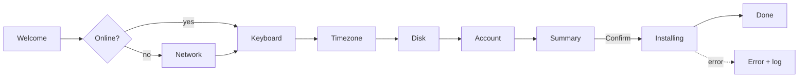
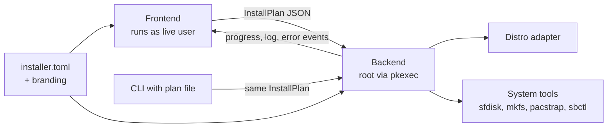

# Dawn — LuminOS installer spec

Last updated: 2026-09-22

## Overview & goals

Dawn is the graphical installer for LuminOS, replacing the Calamares installer the distro ships today. It takes someone from the live ISO to a bootable, configured LuminOS install in eight or nine screens. Package name: `luminos-dawn`.

Goals for v1:

- Install to a whole disk with one default btrfs layout, or into existing partitions in manual mode.
- Install fresh packages online with pacstrap, and fall back to the ISO's own image when offline.
- Collect system language, keyboard, timezone, network (only when offline) and one user account.
- Set up Secure Boot with LuminOS keys when the firmware is in Setup Mode.
- Carry LuminOS branding through config files, not code changes.
- Run headless from a single plan file, so every install can be tested automatically.

Non-goals for v1: disk encryption, dual-boot disk resizing, LVM or RAID, legacy BIOS boot, hibernation, translations beyond English, OEM mode. Each is a candidate for v2.

Done means: a blank QEMU VM boots the ISO, Dawn runs end to end both online and offline, and the VM reboots into Hyprland as the new user.

## Decisions at a glance

| Decision | Choice |
| --- | --- |
| Base distro | LuminOS (Archiso-based, Hyprland on Wayland) |
| Installer | Dawn, package `luminos-dawn`; own UI and backend, replacing Calamares |
| UI | Rust + Slint |
| Backend | Rust, in the same Cargo workspace |
| UI to backend link | Unix socket, newline-delimited JSON |
| Base system | pacstrap from the Arch and LuminOS repos when online; the ISO's squashfs as the offline fallback |
| Package set | Meta-packages `luminos-base` and `luminos-desktop` in luminos-repository; the ISO is built from the same ones |
| Network | NetworkManager; Network screen only when offline; the Wi-Fi profile is copied into the target |
| Firmware | UEFI only |
| Bootloader | systemd-boot with signed unified kernel images (UKIs) |
| Secure Boot | sbctl, offered only in Setup Mode; Microsoft keys kept; UKIs re-signed by sbctl's pacman hook |
| Filesystem | btrfs with @ and @home |
| Encryption | None in v1 |
| Swap | zram, no hibernation |
| Partitioning | Erase mode; manual mode (no resizing) as the last milestone |
| Root access | Root locked; the new user administers via sudo (wheel) |
| Backend privileges | pkexec with a polkit rule scoped to the live user, no password |
| Languages | English only, gettext-ready |
| Licence | GPLv3 (Slint is used under GPLv3) |
| CI | Nightly end-to-end run on GitHub Actions with KVM |

## UI (Slint)

- Screens live in `frontend/ui/*.slint`, compiled at build time; Rust glue owns state, builds the InstallPlan and talks to the backend socket.
- Branding stays runtime-only: a `Theme` global holds colours, product name and image paths, filled from `branding.toml` at startup. A new branding folder needs no rebuild.
- Every UI string uses `@tr(...)`, which Slint backs with gettext; v1 ships English only.
- Rendering: winit backend on Wayland with the FemtoVG renderer; select the software renderer (`SLINT_BACKEND=winit-software`) when no GPU is found, as in many VMs.
- The Hyprland window rule matches a stable window title and app_id; M2 confirms which app_id Slint's winit backend sets.
- UI smoke tests use Slint's testing backend to find elements by accessible label and drive Next and Back.

## User flow

Nine screens, linear, with Back on every screen until Install is pressed; the Network screen appears only when the PC is offline. Nothing touches a disk before the Summary screen's confirm.



Each screen writes one part of the install plan; the Summary screen renders the whole plan in plain words.

| Screen | Collects | Notes |
| --- | --- | --- |
| Welcome | System language (locale); Dawn's own UI is English in v1 | Offers "Try live session" and "Install"; blocks Install when not booted in UEFI mode and explains how to switch |
| Network | A Wi-Fi network and password via NetworkManager, or Skip | Only shown when offline; Skip means an offline install from the ISO's image |
| Keyboard | Layout and variant | Live preview field |
| Timezone | Region and city | Searchable list, guessed from the chosen locale |
| Disk | Target disk, Erase or Manual mode, Secure Boot setup | Shows model, size and serial; hides the live USB; Secure Boot checkbox appears only in Setup Mode, checked by default |
| Account | Full name, username, password, hostname, autologin | Username and hostname derived from full name, editable; this user gets sudo, root stays locked |
| Summary | Nothing new | Lists every change, says online or offline install, names the disk to be wiped, needs an explicit confirm |
| Installing | Nothing | Progress bar, current step, optional branded slideshow, expandable log |
| Done | Nothing | Restart now or keep the live session; after Secure Boot setup, reminds the user to switch Secure Boot on in firmware if it isn't |

## Architecture

The UI's only output is an InstallPlan; the backend's only input is an InstallPlan. That split lets the backend be built and tested headless first, and the UI stays free of root privileges.



The CLI path is how tests, CI and unattended installs drive the backend without a screen.

Components:

- **plan**: shared library with the InstallPlan types, JSON schema and validation. No I/O.
- **backend**: privileged binary. Probes disks, validates a plan, runs the pipeline, streams events. Has a `--dry-run` mode that prints commands instead of running them.
- **adapter**: one module per base distro for the few distro-specific steps (base install, offline cleanup, UKIs, services).
- **frontend**: the Slint GUI. Reads config and branding, asks the backend for disks, builds the plan, shows progress.

Wire protocol over a Unix socket, one JSON object per line. Requests: `list_disks`, `probe_firmware` (UEFI, Secure Boot and Setup Mode state), `check_online`, `validate`, `install`, `cancel`. Events: `progress` (step, percent), `log` (line), `error` (step, message), `done`.

The frontend talks to NetworkManager over D-Bus itself to scan and join Wi-Fi; the backend only checks that the repos are reachable and copies the chosen connection profile into the target.

Example InstallPlan:

```json
{
  "version": 1,
  "locale": "en_US.UTF-8",
  "keyboard": { "layout": "us", "variant": "" },
  "timezone": "Europe/Berlin",
  "hostname": "ada-laptop",
  "source": "pacstrap",
  "packages": ["luminos-base", "luminos-desktop"],
  "network_profile": "home-wifi",
  "disk": {
    "mode": "erase",
    "device": "/dev/disk/by-id/nvme-EXAMPLE_SERIAL",
    "filesystem": "btrfs"
  },
  "secure_boot": { "enroll": true, "microsoft_keys": true },
  "user": {
    "full_name": "Ada Lovelace",
    "username": "ada",
    "password": "<secret>",
    "autologin": false
  }
}
```

`source` is `pacstrap` or `squashfs`; the user always gets sudo and root is always locked, so neither is a plan field.

The user password travels only over the socket, stays in memory, and is redacted in every log line. Disks are addressed by `/dev/disk/by-id/` paths so a plan can never hit the wrong device after a reboot reorders `/dev/sdX`.

## Disk & bootloader

UEFI only, systemd-boot with signed unified kernel images, btrfs, no encryption in v1. Erase mode wipes the chosen disk and writes a fixed GPT layout; Manual mode maps existing partitions to mount points without resizing anything.

Erase-mode layout:

| Partition | Size | Format | Mounted at | Notes |
| --- | --- | --- | --- | --- |
| ESP | 1 GiB | FAT32 | /boot | Holds systemd-boot and the UKIs in `EFI/Linux/` |
| Root | Rest of disk | btrfs, `compress=zstd` | / | Subvolumes @ at / and @home at /home |
| Swap | none | zram | none | Compressed RAM swap via zram-generator; no hibernation |

Manual mode rules:

- Per partition, the user picks a mount point and whether to format it.
- The plan is invalid without exactly one ESP and one root; an existing ESP, for example Windows', can be reused without formatting.
- Partitions not assigned are left untouched.

Boot: mkinitcpio builds one UKI per preset (default and fallback) into `/boot/EFI/Linux/`, with the kernel command line from `/etc/kernel/cmdline`. systemd-boot lists UKIs there automatically, so no loader entries are written.

Secure Boot via sbctl:

- The backend reads the firmware's SecureBoot and SetupMode variables; the Disk screen offers setup only in Setup Mode, because an enforcing firmware would not have booted the unsigned ISO.
- sbctl runs inside the target chroot so the keys land in the installed system: `create-keys`, then `sign -s` for the systemd-boot binary and each UKI, then `enroll-keys --microsoft` last.
- Microsoft keys are always kept, so GPU firmware and a Windows dual-boot keep working.
- sbctl's pacman hook re-signs the UKIs on every kernel update.
- Not in Setup Mode: Dawn installs normally and the Done screen links to the sbctl steps for later.

Firmware check: the Welcome screen looks for `/sys/firmware/efi`. If it is missing, it explains how to switch the PC or VM to UEFI and offers only the live session.

Disk safety:

- Hide the device the live system booted from, and any device with mounted partitions.
- Refuse disks smaller than `min_disk_gib` in `installer.toml`.
- The Summary screen names the disk by model, size and serial, not just a device path.

## Install pipeline

The backend runs twelve steps in fixed order; step 5 has an online and an offline variant, and step 6 runs only offline. Each step is a small unit with its own progress weight and log prefix.

| # | Step | Main tools | Via adapter |
| --- | --- | --- | --- |
| 1 | Validate plan, re-probe the disk, check the repos are reachable when `source` is pacstrap | plan library, lsblk | No |
| 2 | Partition (erase mode) or check assigned partitions (manual mode) | sfdisk, partprobe | No |
| 3 | Format and create btrfs subvolumes | mkfs.fat, mkfs.btrfs, btrfs subvolume | No |
| 4 | Mount everything under /mnt/target | mount | No |
| 5 | Install the base system: pacstrap the meta-packages (online) or unsquash the ISO image (offline) | pacstrap, unsquashfs | Yes |
| 6 | Offline only: remove live-only packages and files | pacman in chroot | Yes |
| 7 | Write fstab, locale, keymap, timezone, hostname, zram config; copy the Wi-Fi profile | genfstab, file writes | Partly (Hyprland keyboard) |
| 8 | Create user, set password, lock root, enable sudo for wheel | useradd, chpasswd, passwd -l | Group name only |
| 9 | Build UKIs | mkinitcpio -P | Yes |
| 10 | Secure Boot, if chosen: create keys, sign, enroll | sbctl in chroot | No |
| 11 | Install the bootloader | bootctl install | No |
| 12 | Enable services, copy the install log into the target, unmount, sync | systemctl enable in chroot, umount | Yes (service list) |

Progress: step 5 dominates the time. pacstrap reports packages installed out of the total, unsquashfs reports bytes; other steps report start and end.

On failure:

- Stop at the failing step, unmount everything, and emit an `error` event with the step and the last 50 log lines.
- No automatic retry or rollback; the target partitions were already formatted. The UI offers Retry from start, Save log, and Quit.
- If pacstrap fails on the network, the error screen also offers switching to the offline install.
- Full log at `/var/log/dawn.log` in the live session, with the password redacted.

## LuminOS adapter

LuminOS is Archiso-based, runs Hyprland on Wayland, and ships Calamares today ([LuminOS README](https://github.com/Lumin-OS/LuminOS)). The `arch` adapter covers its distro-specific steps; luminos-repository and the ISO profile need the changes listed after the table.

| Pipeline step | What the arch adapter does |
| --- | --- |
| 5 Install base system | Online: `pacstrap -K` the meta-packages with the ISO's pacman.conf, which includes the LuminOS repo and its signing key. Offline: unsquash `airootfs.sfs` from the archiso medium; copy `vmlinuz-linux` from the medium if the image has no kernel in `/boot` |
| 6 Remove live-only parts (offline only) | `pacman -Rns` Dawn itself and `mkinitcpio-archiso`; delete the live autologin drop-in, live user and archiso mkinitcpio config; `pacman-key --init` and `--populate` for Arch and LuminOS |
| 7 Locale and keyboard | Uncomment the locale in `/etc/locale.gen` and run `locale-gen`; write `vconsole.conf`; set `kb_layout` and `kb_variant` in the default Hyprland config in `/etc/skel`, so `useradd -m` copies it. Files are written directly, since `localectl` needs a running systemd |
| 8 User | Add the user to `wheel`; sudoers drop-in enabling `%wheel`; `passwd -l root` |
| 9 UKIs | mkinitcpio presets with `default_uki` and `fallback_uki`, systemd-based hooks plus `microcode`; command line in `/etc/kernel/cmdline` |
| 12 Services | Enable NetworkManager and the login manager luminos-desktop depends on; autologin, if chosen, is set in that login manager |

Changes outside Dawn:

- luminos-repository: add `luminos-base` and `luminos-desktop` meta-packages covering Hyprland, the dotfiles in `/etc/skel`, NetworkManager, sbctl, zram-generator and the login manager; publish `luminos-dawn`.
- ISO profile: build `packages.x86_64` from the same meta-packages plus live-only extras, so offline installs match online ones; swap `calamares` for `luminos-dawn`.
- A Hyprland window rule so Dawn opens floating and centred at a fixed size, matched on its class, in the syntax of the Hyprland version LuminOS ships.
- A polkit rule letting only the live user run Dawn's backend action without a password.
- An autostart entry and a launcher bind for Dawn.

## Branding & configuration

One binary, two config locations: behaviour in `/etc/dawn/installer.toml`, looks in `/usr/share/dawn/branding/<name>/`. Changing name, colours or slides never needs a rebuild.

Branding folder:

- `branding.toml`: product name, version string, accent colour, website and support URLs; loaded into the Slint `Theme` global at startup.
- `logo.svg` and `icon.svg`: shown on Welcome and in the window title.
- `slides/01.png` … `slides/NN.png` with optional captions: the Installing screen's slideshow.
- `welcome.md`: short text on the Welcome screen.

Example `installer.toml`:

```toml
branding = "luminos"
adapter = "arch"

[source]
packages = ["luminos-base", "luminos-desktop"]
# offline fallback; install_dir comes from the releng profiledef.sh
squashfs = "/run/archiso/bootmnt/arch/x86_64/airootfs.sfs"

[defaults]
filesystem = "btrfs"
admin_group = "wheel"
min_disk_gib = 32

[screens]
autologin_option = true

[offline_cleanup]
# Dawn itself is always removed by the adapter
remove_packages = ["mkinitcpio-archiso"]
```

## Testing

Every layer except end-to-end runs without real hardware, and the backend is fully testable before any UI exists. Online tests use a pinned local package mirror, never public mirrors, so results are reproducible.

| Layer | What it proves | How | Runs |
| --- | --- | --- | --- |
| Unit | Plan validation, username and hostname rules, partition size math | Plain unit tests in the plan crate | Every commit |
| Dry-run snapshots | The exact command list for online, offline and Secure Boot plans | Backend `--dry-run` output compared to checked-in golden files | Every commit |
| Loop-device integration | Partition, format, mount, pacstrap and unsquash really work | Backend against a 40 GiB sparse file on a loop device, inside a disposable VM | Every commit, CI |
| End-to-end | The ISO installs and the result boots, online and offline | QEMU + OVMF, blank qcow2 disk, headless install via plan file, reboot, wait for login on the serial console | Nightly on GitHub Actions with KVM |
| Secure Boot end-to-end | Keys enroll and the signed system boots with Secure Boot enforcing | OVMF Secure Boot build with an empty key store (Setup Mode) | Nightly |
| UI smoke | Every screen opens, Next and Back work, Network appears only when offline | Slint testing backend against the mock backend | Every commit |

The mock-backend mode doubles as the UI development loop: Dawn's screens can be built and clicked through on any laptop without root.

## Milestones

Backend first, headless, then the UI on top; each milestone ends in something that runs. Claude Code works them in order and does not start the next until the current one's check passes. M7 may slip to v2 without blocking a release.

| # | Scope | Done when |
| --- | --- | --- |
| M0 | Cargo workspace (plan, backend, frontend), plan types, schema and validation, backend CLI with `--dry-run`, GPLv3 licence, cargo-deny | `dawn-backend --dry-run plan.json` prints the full command list; unit and snapshot tests pass |
| M1 | Backend pipeline for erase mode: pacstrap and squashfs paths, locale, user, UKIs, systemd-boot | A plan file installs into a QEMU VM disk both online and offline, and the VM boots to a login prompt |
| M2 | Slint frontend: all nine screens, navigation, `Theme` global, mock-backend mode, builds a plan | Clicking through produces a valid plan identical to a hand-written one |
| M3 | Socket protocol, pkexec with the polkit rule, NetworkManager Wi-Fi screen, live progress and error screens | Dawn installs a VM end to end from the GUI, online and offline; a forced failure shows the error screen with log |
| M4 | Secure Boot via sbctl; keyboard and timezone data | In OVMF Setup Mode, the installed system boots with Secure Boot enforcing |
| M5 | Branding, slideshow, gettext wiring; ISO integration: meta-packages, Hyprland rule, autostart | Swapping the branding folder changes name, logo, colours and slides with no rebuild; the LuminOS ISO boots straight into Dawn |
| M6 | Nightly end-to-end CI | GitHub Actions builds the ISO, installs headless in QEMU online, offline and with Secure Boot, and verifies each reboot |
| M7 | Manual partitioning | Reusing an existing ESP and formatting a chosen root works; unassigned partitions stay untouched |

## Notes for Claude Code

This spec is the source of truth; when code and spec disagree, stop and ask rather than pick one. Keep a `DECISIONS.md` log for anything decided during implementation.

Repo layout:

```
dawn/
  Cargo.toml         # workspace
  plan/              # InstallPlan types, schema, validation — no I/O
  backend/           # dawn-backend: probe, pipeline, socket server, --dry-run
    adapters/        # one module per base distro; arch first
  frontend/          # dawn: Rust glue + ui/*.slint screens, mock-backend mode
  branding/luminos/  # default branding folder
  config/            # example installer.toml, polkit rule, Hyprland rule snippet
  tests/
    golden/          # dry-run command snapshots
    e2e/             # QEMU + OVMF scripts, Secure Boot variant, local mirror setup
  po/                # gettext templates
  LICENSE            # GPLv3
  DECISIONS.md
```

Conventions:

- One milestone per branch; each ends with its Done-when check written as a test or script.
- Every external command goes through one runner module, so dry-run, logging and redaction happen in one place.
- No shell strings: commands are built as argument lists.
- Licence Dawn under GPLv3, as Slint is used under GPLv3: `LICENSE` file, SPDX headers, and a `cargo-deny` check that every dependency is GPLv3-compatible.

Safety rules, non-negotiable:

- Never run the backend without `--dry-run` on a development machine. Real runs only inside a VM or against loop devices.
- The backend refuses to run unless `--target` on the command line matches the plan's disk exactly.
- The backend refuses any disk with mounted partitions or that holds the running system.
- Tests never reference `/dev/sd*` or `/dev/nvme*` directly; only loop devices and VM disks.
- Never run `sbctl enroll-keys` outside a VM with throwaway OVMF variables; on real firmware it changes the machine's trusted keys.
- Never point automated tests at public Arch or LuminOS mirrors; use the pinned local mirror.
